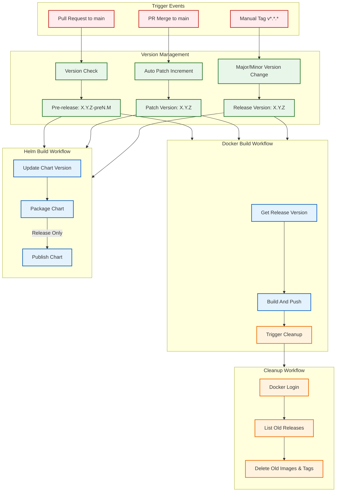

# GitHub Actions Workflow

## Workflow Description

### Triggers
- Pull requests to main branch (excluding paths: charts/**)
- Tag pushes matching v*.*.* pattern
- Manual workflow dispatch

### Docker Build Workflow
1. Checks if the trigger is from main branch or PR
2. Generates semantic version based on git history
   - For main branch: X.Y.Z
   - For PR: X.Y.Z-preN.M (where N is PR number and M is increment)
3. Builds Docker image
4. Pushes image only for releases (non-PR events)
5. Triggers cleanup workflow for old releases

### Cleanup Workflow
1. Authenticates with Docker registry using provided credentials
2. Lists releases older than specified retention period (default: 7 days)
3. Removes outdated images and tags to maintain registry cleanliness

### Version Management
- Release versions follow semantic versioning (X.Y.Z)
- Pre-release versions include PR number and increment (X.Y.Z-preN.M)
- Version tags are generated automatically based on git history
- Version format is consistent across Docker images and Helm charts

### Concurrency Control
- Workflows are grouped by workflow name and git ref
- In-progress workflows are cancelled when new ones are triggered
- Prevents redundant builds and resource waste