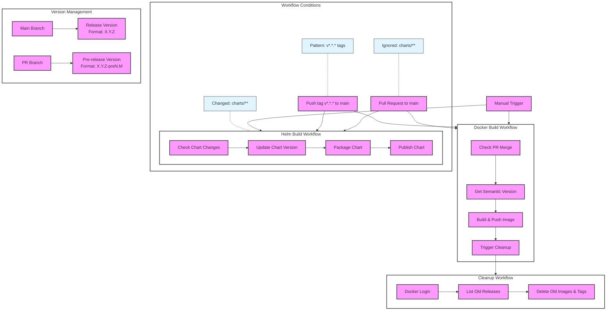

# GitHub Actions Workflow

## Workflow Description

### Triggers
- Pull requests to main branch (paths: cmd/**, Dockerfile)
- Pull requests affecting Helm charts (paths: charts/**)
- Tag pushes matching v*.*.* pattern
- Manual workflow dispatch

### Docker Build Workflow
1. Checks if the trigger is from main branch or PR
2. Generates semantic version based on git history
   - For main branch: X.Y.Z
   - For PR: X.Y.Z-preN.M
3. Builds and pushes Docker image if conditions are met
4. Triggers cleanup workflow

### Helm Build Workflow
1. Validates changes in charts directory
2. Updates chart version based on semantic versioning
3. Packages Helm chart
4. Publishes chart to registry

### Cleanup Workflow
1. Authenticates with Docker registry
2. Lists old releases based on retention policy
3. Removes outdated images and tags

### Version Management
- Release versions follow semantic versioning (X.Y.Z)
- Pre-release versions include PR number and run number
- Version tags are generated automatically based on git history
- Helm chart versions are synchronized with application versions